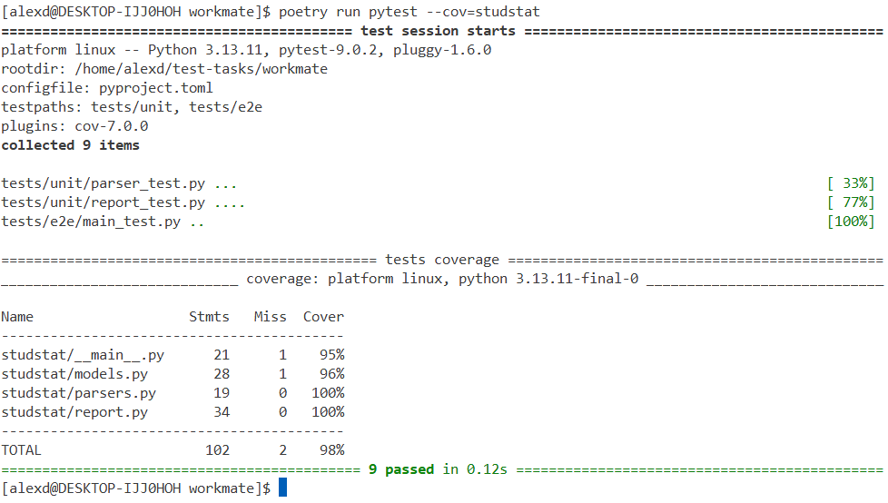
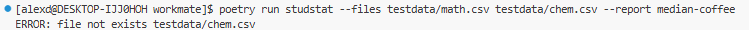
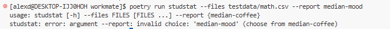
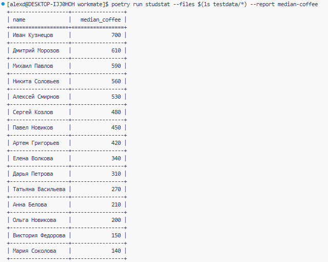
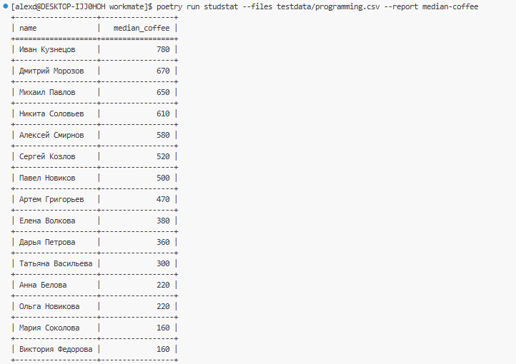

# Тестовое задание


Перед запуском:
```console
$ poetry install 
```

Для запуска:
```console
$ poetry run studstat --files \<files> --report median-coffee
``` 

### Тесты
Перед запуском:
```console
$ poetry install --all-groups 
```

Для запуска тестов:
```console
$ poetry run pytest
```



### Примеры

Запуск с отсутствующим файлом:


Запуск с отсутствующим типом отчета:


Запуск для всех:\


Запуск для programming.csv:


